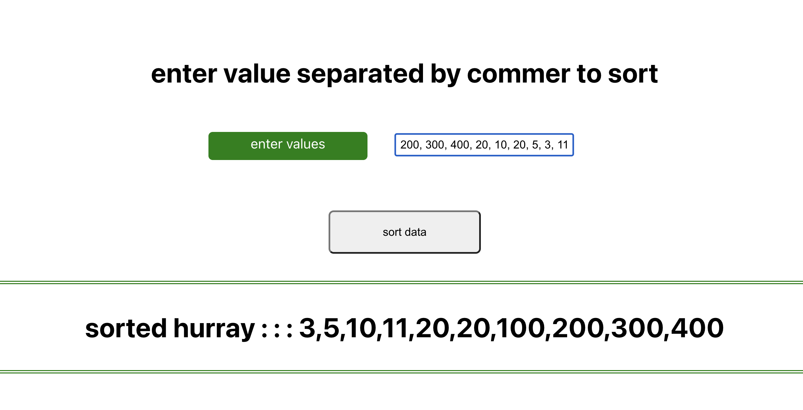

# Selection Sort using react and Class function

from a list of array, we get the minimal value and swap it in the array at the extreme left if its is small than the selected value. 

In every iteration of the selection sort, the minimum element (considering ascending order) from the unsorted subarray is picked and moved to the sorted subarray

### technology

- React
- JavaScript
- HTML
- CSS

### screenShot

